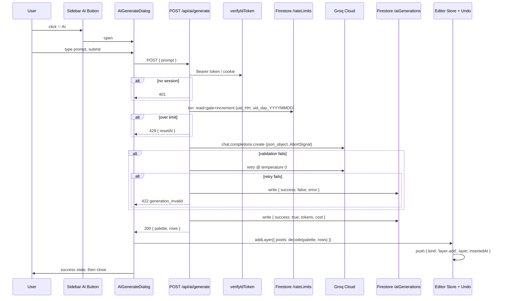

# M16: AI Skin Generation — Plan

> **Milestone posture:** first feature that calls a paid third-party API on the user's behalf. Free-forever stays a hard constraint via Groq's free LLM tier (no image-generation API). Every subsequent paid-AI feature inherits M16's secret-handling, rate-limiting, abuse-logging, and prompt-encoding decisions — get them right once.

## Overview

M16 ships a single end-to-end flow: **signed-in user clicks "✨ AI" in the editor → dialog collects a prompt (≤200 chars) → POSTs to `/api/ai/generate` → server validates session, checks Firestore-backed per-user rate limit, calls Groq for a structured palette+RLE skin description, validates and decodes to a 64×64 RGBA buffer → response returned → client adds the result as a new active layer named `AI: <prompt>` and pushes one `layer-add` undo command**.

Eight units:

| # | Unit | New / modified files |
|---|---|---|
| 0 | Dependencies + env scaffold | `package.json`, `.env.local.example`, `firestore.rules` |
| 1 | Skin codec (palette + RLE encoding/decoding) | `lib/ai/skin-codec.ts` + tests |
| 2 | Groq client + system prompt | `lib/ai/groq.ts`, `lib/ai/prompt.ts`, `lib/ai/types.ts` + tests |
| 3 | Firestore rate limiter + abuse log | `lib/ai/rate-limit.ts`, `lib/firebase/ai-logs.ts` + tests |
| 4 | `/api/ai/generate` API route | `app/api/ai/generate/route.ts` + tests |
| 5 | `AIGenerateDialog` component | `app/_components/AIGenerateDialog.tsx` + tests |
| 6 | Editor integration — Sidebar button + dialog mount + wiring | `app/editor/_components/Sidebar.tsx`, `app/editor/_components/EditorLayout.tsx` |
| 7 | Manual QA + COMPOUND entry | `docs/COMPOUND.md` (M16 entry); operational checklist; rules deploy |

## Problem Frame

DESIGN §3 calls out "AI-generated content — *Prompt-to-Base*" as a Phase 2 deferral. The product hypothesis is that pixel-art skins are intimidating to start from a blank canvas, and a one-click "give me something I can iterate on" feature lowers activation friction. M11's templates already partially address this (curated starter skins) but cap the variety at the curated set.

M16 keeps the **free-forever** product invariant by going text-LLM-only — Groq emits a small JSON description of the skin (palette + RLE rows), the client decodes to RGBA. No image API, no server-side rendering, no hosting cost beyond a sub-cent LLM call.

The *first* paid-API feature is the riskiest one to scope and plan because every abuse vector compounds into a bill. Rate limiting, prompt validation, fail-closed counter checks, secret-handling discipline, and abuse logging must all land in this milestone — there is no "add it later" without already paying for the gap.

## Requirements Trace

- **R1 (DESIGN §3 Phase 2 deferral; product activation goal).** A signed-in user can click an "✨ AI" affordance in the editor, type a free-form prompt up to 200 characters, and receive a generated 64×64 RGBA skin layer in under ~10 seconds median.
- **R2 (cost-bounded operation).** Per-user generation cost stays under ~$0.01/gen at planning estimates, with a per-user cap of 5 generations / hour and a hard daily cap of 30 generations / user, plus an org-wide daily token-spend cutoff. Aggregate monthly cost stays under **$50/month at 100 daily-active users averaging ≤3 gens/day**. The original "free-forever / under $15/year" framing in the milestone brief is preserved as an *aspirational* posture: at very low scale (≤20 active users) the budget realistically holds, but at projected adoption the operative budget is $50/month — reviewed weekly via aggregated `costEstimate`. If two consecutive weeks exceed the monthly burn, lower the per-user hourly cap from 5 → 3 or add an email-verified gate. The milestone-posture line ("free-forever stays a hard constraint") in the Overview header should be read in this light.
- **R3 (M9 §Invariants line 609; M11 §Conventions).** All Groq SDK code paths import from `server-only` modules. `GROQ_API_KEY` is read at invocation time inside the route handler, never at module load. The `groq-sdk` package never reaches the client bundle (verified via `next build` First Load JS delta on `/editor`).
- **R4 (anti-abuse).** Unauthenticated requests to `/api/ai/generate` return 401 without partial side effects. Email-unverified accounts are accepted in M16 (deferred verification gate to a later milestone) but every generation is logged to `/aiGenerations/{autoId}`.
- **R5 (M11 §Invariants line 810; serverless cold-start invariant).** Per-user rate limiting is enforced via Firestore counter docs at `/rateLimits/{uid}_{YYYYMMDDHH}` using `FieldValue.increment` inside a transaction. In-memory module-level state is **never** used as a rate-limit source of truth (cold starts and horizontal scale make it unsound).
- **R6 (failure semantics).** Groq SDK errors are translated to typed user-facing messages (rate-limited → 429 with retry-after; bad request → 400; auth/upstream → 500 with shape-only diagnostic). On JSON-validation failure (palette out of range, row count drift, RLE run sums ≠ 64), the route retries once with `temperature: 0` before returning a typed `generation_invalid` error.
- **R7 (M10 §Pinned facts; bundle baseline).** `/editor` First Load JS stays within **+5 kB** of the M11 baseline (478 kB). All Groq SDK code, prompt strings, rate-limit logic, and Firestore admin writes run server-side only.
- **R8 (UX — undo).** Applying an AI generation produces exactly **one** `layer-add` command on the undo stack, mirroring the M11 LayerPanel "+ New Layer" button behavior. Undo restores the pre-generation editor state in a single keystroke.
- **R9 (M9 §Invariants line 609; env-var hardening).** The route translates `GROQ_API_KEY` misconfiguration into a shape-only diagnostic in the 500 response body so Vercel env-paste mistakes are visible to the operator without leaking key material. Pattern lifted from commit `de8f76f`.
- **R10 (M9 §Invariants line 626; rules coverage).** A new `/aiGenerations/{docId}` rules block denies all client reads/writes (admin SDK bypasses); a new `/rateLimits/{docId}` block denies same. Both are deployed before first production traffic.

## Scope Boundaries

- **No** image-generation API (DALL-E, Midjourney, Stable Diffusion). Cost and free-forever invariant rule them out for M16. Re-evaluate post-Phase 2 if Groq's JSON output proves insufficient.
- **No** prompt-suggestion / prompt-history UI. The dialog is a single textarea + submit button. Recent prompts are not surfaced.
- **No** "regenerate" with the same prompt. User must re-submit. Counts against the rate limit either way.
- **No** streaming responses. Groq's structured-output mode does not support streaming, and the UX latency budget (~10s) does not justify partial-render complexity.
- **No** "apply to existing layer (replace)" mode. AI generations always add a new layer; the user explicitly deletes via LayerPanel if they want to replace. Keeps undo semantics simple and protects user work.
- **No** moderation / NSFW filter beyond Groq's built-in policy enforcement. Manual review of `/aiGenerations` logs is the M16 abuse mitigation; automated content classification is post-M16.
- **No** admin dashboard for AI logs. The data lands in Firestore; reading it is a `gcloud firestore` query for M16. UI dashboard is post-M16.
- **No** credit system / paid tier. Rate limiting only. Paywall infrastructure is a separate milestone.
- **No** Edge runtime. Same `firebase-admin` Node-runtime constraint as every other API route in the project.
- **No** caching of identical prompts. Same prompt → fresh LLM call → new generation, billed.
- **No** App Check / reCAPTCHA enforcement in M16. Recommended in COMPOUND for follow-up if abuse signals appear; deferred to keep M16 scope tight.

## Context & Research

### Relevant Code and Patterns

- **`app/api/skins/publish/route.ts`** — canonical M11 server route: `import 'server-only'` + `runtime = 'nodejs'` + `dynamic = 'force-dynamic'` + Bearer-token auth via `verifyIdToken` (commit `ebddd96`) + invocation-time env validation + shape-only env diagnostic (commit `de8f76f`) + `Cache-Control: private, no-store, no-cache, must-revalidate`. M16's route copies this skeleton.
- **`app/api/skins/__tests__/publish.test.ts`** — vi.hoisted + vi.mock factory pattern for mocking `next/headers`, `@/lib/firebase/admin`, and external SDKs. M16 tests inherit the same scaffold and add a `groq-sdk` mock.
- **`app/_components/PublishDialog.tsx`** — hand-rolled ARIA dialog (role=dialog, aria-modal, focus trap, Escape/backdrop close, idle/loading/success/error state machine, async `onPublish` handler injected by caller). M16's `AIGenerateDialog` mirrors structure with a textarea + character counter substituted for the name/tags inputs.
- **`app/editor/_components/EditorLayout.tsx`** — owns `UndoStack`, lazy-loads dialogs via `next/dynamic({ ssr: false })`, threads `onLayerUndoPush` through `Sidebar` → `LayerPanel`. M16's dialog mount + handler wire alongside `PublishDialog` here.
- **`app/editor/_components/Sidebar.tsx`** — host for editor controls (Toolbar, UndoRedoControls, LayerPanel, Export trigger, Publish trigger). M16's "✨ AI" button mounts here, **not in `Toolbar.tsx`** (Toolbar is paint-tool radio group only).
- **`app/editor/_components/LayerPanel.tsx`** — the canonical "create a new layer" pattern: build a `Layer` with `crypto.randomUUID()` id, allocate a 16384-byte `Uint8ClampedArray`, call `useEditorStore.getState().addLayer(layer)`, then call `onUndoPush?.({ kind: 'layer-add', layer, insertedAt })`. M16's apply-result handler reuses this exact shape.
- **`lib/editor/types.ts`** — `Layer` and `SkinVariant` types. `Layer.pixels.length === 64*64*4 === 16384` is a contract enforced by every consumer; M16 codec must produce buffers that satisfy it.
- **`lib/editor/store.ts:325-331`** — `addLayer(layer): string` returns the new layer id and sets it active. AI-generation handler calls this directly.
- **`lib/editor/undo.ts`** — `Command` union with existing `layer-add` kind. M16 does **not** add a new command kind; reusing `layer-add` keeps the undo stack semantics unchanged.
- **`lib/firebase/admin.ts`** — `getAdminFirebase()` cached singleton with shape-only env-var diagnostic (commits `b0ae694` → `de8f76f`). M16 reuses the singleton; no new admin SDK init.
- **`lib/firebase/skins.ts`** — `FieldValue.serverTimestamp()` for `createdAt`/`updatedAt`, batch writes for atomic multi-doc updates. M16's abuse-log + rate-limit-counter writes follow the same patterns.
- **`lib/firebase/auth.ts`** — `getServerSession()` (cookie path, M10) and Bearer-token verification (M11 helper). M16 uses Bearer-token first, cookie-session fallback, mirroring `publish/route.ts`.
- **`firestore.rules`** — current rules cover `/users` and `/skins`. M16 appends `/aiGenerations/{docId}` and `/rateLimits/{docId}` blocks denying all client access (admin-SDK-only).
- **`vitest.config.ts`** — already aliases `server-only` → `node_modules/server-only/empty.js`. M16 server-only modules import safely from tests.

### Institutional Learnings

- **Singleton + env-read-at-init-time** (COMPOUND M9 §Invariants line 609). Read `process.env.GROQ_API_KEY` inside the route handler, not at module load. Vercel env changes between build and runtime are honored, and `vi.stubEnv` works without dynamic imports.
- **Storage-first-then-Firestore rollback semantics** (COMPOUND M11 §Invariants — *Uploads must precede Firestore writes*). Not directly applicable to M16 (no storage uploads), but the discipline transfers: rate-limit increment must succeed *before* the LLM call fires. Decision (locked, see §Key Technical Decisions): increment counter inside the same transaction that gates the call (read + check + write atomically); the slot is **burned** on every downstream failure (not refunded). Argument and tradeoffs made explicit below.
- **`FieldValue.increment` is lock-free** (COMPOUND M11 §Invariants line 812) but two concurrent reads-then-increments can race past the gate. **At 5 reqs/hour the practical leak is one or two, but for a paid endpoint the safe path is `db.runTransaction`** (read counter, gate, write increment, all atomic). Use it.
- **Doc-IDs encode uniqueness; rules enforce them** (COMPOUND M9 §Invariants line 626). The rate-limit doc ID `{uid}_{YYYYMMDDHH}` encodes the window and the actor; `firestore.rules` denies all client access so no one can spoof a doc ID.
- **`server-only` shim is already in vitest.config.ts** (COMPOUND M9 §Invariants line 625). M16 server modules test cleanly without manual setup.
- **`vi.hoisted` + `vi.mock` factory is canonical** (COMPOUND M10 §What worked line 707). M16's `app/api/ai/generate/__tests__/route.test.ts` mocks `groq-sdk`, `next/headers`, and `@/lib/firebase/admin` via this pattern.
- **API routes run Node runtime, not Edge** (COMPOUND M10 §Gotchas line 736). `runtime = 'nodejs'` is mandatory because of `firebase-admin`. `groq-sdk` itself supports Edge but Node is forced anyway.
- **Shape-only env diagnostic** (commit `de8f76f`). When `GROQ_API_KEY` is missing/malformed, the route's 500 response includes `{ debug: { envKeyShape: { present: bool, length: number, prefix: string } } }` so the user can debug Vercel env paste without seeing key material.
- **`request.json()` is not idempotent** (COMPOUND M10 §Gotchas line 737). Read body into a const before any retry path.
- **React 19 + jsdom: input value-set quirk** (COMPOUND M10 §Invariants line 729). `AIGenerateDialog` tests use the `HTMLInputElement.prototype.value` setter trick already established in `PublishDialog.test.tsx`.

### External References

- **Groq SDK** (`groq-sdk` 1.1.2 on npm) — OpenAI-shaped: `new Groq({ apiKey, timeout, maxRetries })`, `groq.chat.completions.create({ model, messages, response_format })`, accepts `signal: AbortSignal` per request. Throws `BadRequestError`, `AuthenticationError`, `RateLimitError`, `InternalServerError`, `APIConnectionError`, `APIConnectionTimeoutError`. https://github.com/groq/groq-typescript
- **Model selection** — `llama-3.1-70b-versatile` was deprecated 2025-01-24 (returns errors). M16 uses `llama-3.3-70b-versatile` (production, 128K ctx, 32,768 max output, $0.59/$0.79 per 1M tokens). Strict JSON-Schema mode is supported on `openai/gpt-oss-120b` and `openai/gpt-oss-20b`; **decision recorded below: M16 ships with `llama-3.3-70b-versatile` + `response_format: { type: 'json_object' }`** for simplicity, with a fallback to `openai/gpt-oss-120b` strict-schema if validation failure rate exceeds 10% in production logs. https://console.groq.com/docs/models, https://console.groq.com/docs/structured-outputs
- **Free tier rate limits** — 30 RPM / 1,000 RPD / 12,000 TPM / 100,000 TPD org-wide on `llama-3.3-70b-versatile`. Per-user 5/hr cap multiplied by ~100 active users projects to ~500 generations/day (well under 1,000 RPD). TPM is the binding constraint at high concurrency; addressed via per-user rate limit.
- **Firestore TTL policy** — set on `expireAt: Timestamp` field for the `rateLimits` and `aiGenerations` collections. Sweep is best-effort within 24h. Free of charge. https://firebase.google.com/docs/firestore/ttl
- **Cost estimate** — palette+RLE encoding (~500 input + ~3K output tokens) ≈ **$0.0027/generation**, not the $0.0004 the original brief claimed (off by ~7×). At the 5/hr × 30/day cap, worst-case per-user cost is $2.43/month; at 100 active users averaging ~3 gens/day, monthly cost is ~$24 — exceeds the $15/year claim if usage is actually that high. Decision recorded below: track aggregate cost weekly and adjust caps if projection exceeds budget.

## Key Technical Decisions

- **Encoding scheme: palette + per-row RLE.** Rationale: naive 4096-cell `[r,g,b,a]` JSON output is ~80K tokens (over the 32,768 max-completion cap and ~$0.06/gen). Palette-of-≤16-colors with per-row run-length encoding produces ~1.5K–3K output tokens and round-trips losslessly to a `Uint8ClampedArray`. JSON Schema:
  ```
  { palette: string[]   // ["#rrggbbaa", ...], length 1..16
  , rows: [[number, number]][]  // 64 rows, each a list of [paletteIndex, runLength] pairs whose runs sum to 64
  }
  ```
  Server-side validation: `palette.length` 1..16, every hex matches `/^#[0-9a-f]{6}([0-9a-f]{2})?$/i`, `rows.length === 64`, every row's run sum is exactly 64, every palette index is in `[0, palette.length)`.
- **Single layer-add undo command, not a new command kind.** AI generation creates a new `Layer` named `AI: <prompt-truncated-to-30>` and calls the existing `addLayer` + `layer-add` undo path used by `LayerPanel`'s "+ New Layer" button. No undo.ts changes. Rationale: matches user mental model ("AI gave me a new layer I can edit"), preserves user's existing artwork, single-command undo is one keystroke, zero new test coverage of undo internals.
- **Firestore-backed rate limiting, transaction-gated.** In-memory `Map<uid, count>` is unsound on Vercel (cold starts, multiple instances) per COMPOUND M3 §Invariants line 188. Doc-ID convention: `/rateLimits/{uid}_{YYYYMMDDHH}` for per-hour buckets and `/rateLimits/{uid}_day_{YYYYMMDD}` for per-day. Both checked in the same transaction. Counters set `expireAt = Timestamp(window-end + 1h buffer)` and TTL policy sweeps them; no Cloud Function needed.
- **Bearer-token auth first, cookie-session fallback.** Mirrors `publish/route.ts` post-`ebddd96`. **No shared `verifyIdToken` helper exists in `lib/firebase/auth.ts`** — the implementation pattern is to inline `await getAdminFirebase().auth.verifyIdToken(token, /* checkRevoked */ true)` exactly as `publish/route.ts` does, and to fall through to `getServerSession()` only when the Bearer header is absent. `checkRevoked: true` is critical: it costs an extra round-trip but ensures `revokeRefreshTokens()` is honored immediately rather than waiting for the 1h ID-token refresh window — appropriate for a paid endpoint with a stolen-token threat model. Auth resolution happens before rate-limit check (don't burn a counter slot for a 401).
- **Groq model: `llama-3.3-70b-versatile` + `response_format: { type: 'json_object' }`.** Strict JSON-Schema mode (`gpt-oss-120b`) is the safer choice but requires a different model and may have different latency / cost characteristics. M16 ships with `json_object` mode + defensive validation + one retry at `temperature: 0` on validation failure. Open question for M17+: switch to strict schema if measured retry rate > 10%.
- **Per-request `AbortSignal` wired from `request.signal`.** If the client disconnects (closes browser, navigates away), the in-flight Groq call is cancelled. Constructor `timeout: 30_000` (30s hard cap; Groq median is 2-5s for ~3K-token output). **Caveat:** Vercel may keep the function executing after the client disconnects, and Groq still bills tokens generated up to the abort point. Client abort is not a free-cancel — it's a best-effort early-cut. The hard cap on cost is `max_completion_tokens: 4000` (above), not the abort signal.
- **Fail closed on Firestore counter outage.** If the rate-limit transaction throws (Firestore down, quota exhausted, etc.), the route returns 503 without calling Groq. Rationale: industry standard for paid endpoints (Stripe, OpenAI, GitHub). Logged separately so the operator can distinguish transient outages from sustained ones.
- **Aggregate cost kill-switch.** A single Firestore doc `/aiConfig/global` with `{ enabled: boolean, todayTokens: number, todayDate: 'YYYYMMDD' }` is read inside the rate-limit transaction. If `enabled === false` OR `todayTokens > AGGREGATE_TOKEN_CAP` (initial value 80,000 — well below Groq free-tier 100K TPD), the route returns 503 `service_paused` without any per-user counter increment. Operator can flip `enabled` in Firebase Console for a sub-minute incident response (no code deploy). `todayTokens` is incremented by `usage.total_tokens` in the post-LLM logging path; the date field self-resets via "if `todayDate !== today`, set both fields fresh" inside the same transaction. Rules deny client read/write so only admins (or the route via Admin SDK) touch it. This addresses the Twitter-spike / org-TPM-cap risk that per-user caps alone cannot bound.
- **Slot policy on failures: burn, with one exception.** The rate-limit slot is **burned** on prompt-validation failures (caller's input was bad, no LLM call), Groq validation failures after retry (LLM was called and billed, slot represents the spend), and most error paths. The single **refund** case is `GroqAbortedError` from a *server-side timeout* before any LLM completion (the Groq SDK's connection-aborted before token-stream-started). Rationale: refunding model-side completion failures would let an attacker craft prompts that reliably fail validation and effectively get unlimited paid LLM calls; refunding pre-stream timeouts is safe because no tokens were billed. The refund path is a fire-and-forget transactional decrement on the same docs the original transaction wrote, with floor-at-0 semantics.
- **AI generation logs are write-only from the route.** `/aiGenerations/{autoId}` records `{ uid, prompt, model, createdAt, expireAt, success, error?, validationFailureCategory?, retryCount, finishReason, tokensIn, tokensOut, costEstimate }`. **`ipHash` is intentionally NOT logged here** — it lives only in the rate-limit bucket docs (`/rateLimits/ip_*`), which TTL-sweep within ~26h. Co-locating `uid` and `ipHash` in a 90-day-retained collection would enable retroactive deanonymization if `IP_HASH_SALT` ever leaks. No client read access (rules deny). Reading is a `gcloud firestore` operator action for M16; admin UI is post-M16.
- **Prompt is logged verbatim with light PII redaction.** Prompts are user-generated skin descriptions, but a textarea accepts anything — phone numbers, emails, addresses can land by accident. Pre-log redaction collapses obvious-PII patterns into `[REDACTED:phone]`, `[REDACTED:email]`, `[REDACTED:cc]` before write (regex-based, not perfect, but covers the accidental-paste cases). A user-deletion path (`gcloud firestore` query that deletes by `uid` on user request) is documented in the operational checklist. If a prompt-history UI lands later it must add a self-serve delete path.
- **Groq SDK is `await import()`'d inside the route handler, not statically imported.** Defends against any accidental client-bundle leak via shared-module imports (COMPOUND M10 §What didn't line 716 caveat). The cost of a dynamic import on first invocation is one-time-per-cold-start.
- **`lib/ai/types.ts` is the only client-importable AI module.** Shared types (`AISkinResponse`, `AIGenerateError`) live here. Everything else under `lib/ai/` and `lib/firebase/ai-logs.ts` starts with `import 'server-only'`.

## Open Questions

### Resolved During Planning

- **Q: Does Groq's JSON output reliably produce 64×64 with correct RLE sums?** A: Documented failure modes exist (truncation at length cap, row-count drift, palette-index OOR). Resolution: schema validation + retry-once at `temperature: 0` + typed `generation_invalid` user-facing error if the retry also fails. Track retry rate in `/aiGenerations` log to inform M17's strict-schema migration decision.
- **Q: Should AI generation replace the active layer or add a new layer?** A: Add a new layer. Rationale documented above. The original brief said "apply to active layer" — interpreted as "the new layer becomes the active layer", which preserves existing user work and gives a single-command undo.
- **Q: In-memory rate limiter — how to make it work on Vercel?** A: It can't. Replaced with Firestore-backed counter + transaction. In-memory state is a pure performance optimization layer that only makes sense once Upstash/Redis is on the table; M16 stays on Firestore for free-forever and operational simplicity.
- **Q: Where does the "✨ AI" button mount?** A: `app/editor/_components/Sidebar.tsx`, between `LayerPanel` and the Export action. **Not** in `Toolbar.tsx` (paint-tool radio only). No keyboard shortcut in M16 (defers a key-claim discussion).
- **Q: How is the GROQ_API_KEY surfaced when missing on Vercel?** A: Same shape-only diagnostic pattern as `FIREBASE_ADMIN_PRIVATE_KEY` (commit `de8f76f`): `{ envKeyShape: { present, length, prefix: first-4-chars-or-empty } }` in the 500 response body. The 4-char prefix is just enough to confirm a Groq-shaped key (`gsk_`) without leaking any organization-keyed entropy. No key material exposed.
- **Q: Free-forever invariant — is the cost claim true?** A: $0.0027/gen × 5/hr × ~50 active hours/month = ~$0.68 per super-active user per month. At 100 super-active users that's ~$68/month, which exceeds the brief's $15/year. **Updated success criterion (R2): track aggregate cost weekly via `/aiGenerations.costEstimate` aggregation; if monthly burn exceeds $50, lower the per-user cap from 5/hr to 3/hr or add an email-verified gate.**
- **Q: Does `groq-sdk` add to client bundle if any client-imported module re-exports a type?** A: Yes, if the type's source module is also reachable from the server route. Resolution: `lib/ai/types.ts` is pure types only (no runtime exports). `lib/ai/groq.ts`, `lib/ai/prompt.ts`, `lib/ai/skin-codec.ts` (the encoder uses no SDK), and `lib/ai/rate-limit.ts` all start with `import 'server-only'`. Verified at unit creation time.
- **Q: Does Firebase Admin SDK have a free quota for Firestore writes that covers M16's traffic?** A: Yes. 100 active users × 5 gens/hr × 8 hr/day × 30 days = 120K ops/month. Firestore free tier is 20K writes/day = 600K/month. Comfortable headroom.

### Deferred to Implementation

- **Exact prompt template wording.** Final system-prompt text emerges during Unit 2 implementation when test prompts surface model failure patterns. Plan commits to the structural shape (system instruction + few-shot example with palette+RLE schema) but not the literal string.
- **Final palette size cap (8 vs 12 vs 16).** Plan starts at 16; if the model commonly emits palettes that overflow rows or hallucinate indices, lowering to 12 or 8 may improve reliability. Tuned during Unit 2.
- **Whether to add the `expireAt` Firestore TTL policy via `gcloud` or Firebase Console.** Deferred to Unit 7 operational checklist. Both are fine.
- **Exact retry strategy for `RateLimitError` from Groq.** Plan says "honor `retry-after` header"; specific backoff curve (single retry vs exponential) is implementation-time.
- **Whether the dialog shows an estimate of remaining generations.** Deferred to Unit 5; nice-to-have if the rate-limit response includes a `remaining` count, but not blocking.

## High-Level Technical Design

> *This illustrates the intended approach and is directional guidance for review, not implementation specification. The implementing agent should treat it as context, not code to reproduce.*



## Implementation Units

- [x] **Unit 0: Dependencies + env scaffold + rules append**

**Goal:** Add `groq-sdk` dependency, document `GROQ_API_KEY` and `IP_HASH_SALT` env vars, append `/aiGenerations` and `/rateLimits` rules blocks. No runtime behavior change yet.

**Requirements:** R3, R10

**Dependencies:** None

**Files:**
- Modify: `package.json` (add `groq-sdk` to dependencies)
- Modify: `.env.local.example` (add `GROQ_API_KEY=` and `IP_HASH_SALT=` stubs with comments — `IP_HASH_SALT` is a random ≥32-char hex string used to one-way-hash IPs into rate-limit doc IDs without storing reversible IP material)
- Modify: `firestore.rules` (append `/aiGenerations/{docId}` and `/rateLimits/{docId}` deny-all blocks)

**Approach:**
- Pin `groq-sdk` minimum version (allow patch bumps within minor) per M1's pin discipline.
- Rules: `match /aiGenerations/{docId} { allow read, write: if false; }` and same for `/rateLimits`. Admin SDK bypasses rules; routes are the only writers.
- No code that imports `groq-sdk` lands in this unit.

**Patterns to follow:**
- M11's pin-discipline (`docs/COMPOUND.md` M11 §Pinned facts).
- Existing rules block layout in `firestore.rules`.

**Verification:**
- `npm install` succeeds without warnings.
- `npm run build` succeeds; `/editor` First Load JS unchanged from baseline (478 kB).
- `firestore.rules` syntax-checks via `firebase deploy --only firestore:rules --dry-run` if the operator runs it.

---

- [x] **Unit 1: Skin codec — palette + RLE**

**Goal:** Pure encoder/decoder between `{ palette, rows }` JSON shape and `Uint8ClampedArray(16384)`. No SDK imports, no I/O, fully unit-testable.

**Requirements:** R6, R8

**Dependencies:** None

**Files:**
- Create: `lib/ai/skin-codec.ts`
- Create: `lib/ai/types.ts` (defines `AISkinResponse = { palette: string[]; rows: [number, number][][] }` and error types — pure types module, importable from client)
- Test: `lib/ai/__tests__/skin-codec.test.ts`

**Approach:**
- `decode(response): Uint8ClampedArray` parses palette hex strings into RGBA tuples, walks each row's RLE pairs, and writes 16384 bytes. Throws typed `CodecError` on any validation failure (palette empty/oversized, row count drift, runs sum mismatch, palette index out of range, malformed hex).
- Hex parsing accepts `#rrggbb` (alpha=255) and `#rrggbbaa`. Case-insensitive.
- Pure module — no `'use client'`, no `'server-only'`. Exported types live in `lib/ai/types.ts` so server modules and client modules can both reference `AISkinResponse` without dragging the codec into client bundles.
- **Validation order is fixed: validate the entire shape BEFORE any pixel write.** Step 1 — parse and validate palette (length, hex format, return RGBA tuple table). Step 2 — validate rows.length === 64 and every row's run sum === 64 and every palette index < palette.length. Only after all validations pass is a `Uint8ClampedArray(16384)` allocated and written. This prevents any partial-write state on a malformed payload and removes the possibility of an out-of-bounds write even under attacker-crafted inputs.

**Test scenarios:**
- Happy path: 16-color palette, 64 rows of valid RLE pairs → returns 16384-byte buffer with correct RGBA values at known coordinates.
- Happy path: 1-color palette, all rows `[[0, 64]]` → solid 64×64 of that color.
- Happy path: hex without alpha `#aabbcc` decodes to `[0xaa, 0xbb, 0xcc, 255]`.
- Edge case: hex with alpha `#aabbcc80` decodes to `[0xaa, 0xbb, 0xcc, 0x80]`.
- Error path: empty palette throws `CodecError('palette_empty')`.
- Error path: palette length 17 throws `CodecError('palette_too_large')`.
- Error path: row count 63 throws `CodecError('row_count_invalid')`.
- Error path: row with run sum 63 (under) throws `CodecError('row_runs_invalid')`.
- Error path: row with run sum 65 (over) throws `CodecError('row_runs_invalid')`.
- Error path: palette index 5 in a 3-color palette throws `CodecError('palette_index_oor')`.
- Error path: malformed hex `#xyz` throws `CodecError('palette_hex_invalid')`.
- Boundary: run length 0 in an RLE pair throws `CodecError('row_runs_invalid')`.

**Verification:**
- All scenarios pass.
- A round-trip helper `encode(pixels) → response` (optional, for future use; see Note below) is **not** implemented in M16 — only `decode` is needed by the route. Encoder lives as a deferred item.

---

- [x] **Unit 2: Groq client + system prompt**

**Goal:** Server-only Groq SDK wrapper that takes a user prompt and returns a validated `AISkinResponse`, with retry-on-validation-failure built in.

**Requirements:** R3, R6

**Dependencies:** Unit 1

**Files:**
- Create: `lib/ai/groq.ts` (starts with `import 'server-only'`)
- Create: `lib/ai/prompt.ts` (starts with `import 'server-only'`; exports `SYSTEM_PROMPT`, `buildMessages(userPrompt)`)
- Test: `lib/ai/__tests__/groq.test.ts`

**Approach:**
- `getGroqClient()` is a request-scoped factory that reads `GROQ_API_KEY` at invocation time, throws `GroqEnvError` with shape-only diagnostic if missing/malformed. No module-level singleton (matches M9 §Invariants line 609 discipline).
- `generateSkin(userPrompt, signal): Promise<AISkinResponse>` calls `groq.chat.completions.create({ model: 'llama-3.3-70b-versatile', messages: buildMessages(userPrompt), response_format: { type: 'json_object' }, temperature: 0.8, max_completion_tokens: 4000, signal })`, parses content, validates via `lib/ai/skin-codec.ts` `validateResponse(json)`, returns or throws `CodecError`.
- **`max_completion_tokens: 4000` is a hard cost-amplification cap.** A realistic palette+RLE response is ~1.5K-3K output tokens; 4K provides headroom while preventing prompt-manipulation attacks ("repeat the palette 1000 times") from driving output toward the model's 32,768 max — which would 10× per-gen cost. This cap is paired with `finish_reason === 'length'` detection: if the model truncates, treat as a validation failure and trigger the retry-at-`temperature: 0` path (which produces shorter, more deterministic output).
- Retry path: if validation throws, re-call once with `temperature: 0` and a stricter inline reminder in the user message. If retry also fails, throw `GroqValidationError` containing the last `finish_reason` and a sample of the malformed payload (truncated to 200 chars for log safety).
- Translates SDK errors into typed errors: `GroqRateLimitError` (with `retryAfterSeconds`), `GroqAuthError`, `GroqUpstreamError`, `GroqTimeoutError`, `GroqAbortedError`.
- `await import('groq-sdk')` inside the function body, not top-level, per M11 §What worked OG-image precedent.
- System prompt design: instruct the model that the output is a 64-row × 64-column pixel grid in RLE form, give a short JSON example with palette of 4 colors and 64 rows, and explicitly tell it not to wrap in code fences. Prompt copy is iterated in this unit but the structural shape is fixed.

**Test scenarios:**
- Happy path: SDK returns valid JSON → `generateSkin` returns parsed `AISkinResponse`.
- Happy path: signal aborts mid-request → `GroqAbortedError`.
- Edge case: SDK returns content wrapped in code fences (```json ... ```) → strip fences, parse, succeed.
- Edge case: SDK returns prose preamble + JSON → reject and retry once.
- Error path: validation fails on first call → retry at `temperature: 0` is invoked.
- Error path: retry also fails → `GroqValidationError` with `finishReason` and truncated payload.
- Error path: SDK throws `RateLimitError` → `GroqRateLimitError` with `retryAfterSeconds` populated from the response header.
- Error path: SDK throws `AuthenticationError` → `GroqAuthError` (operator-facing; not user-facing).
- Error path: SDK throws `APIConnectionTimeoutError` after default retries → `GroqTimeoutError`.
- Error path: missing `GROQ_API_KEY` → `GroqEnvError` with `{ envKeyShape: { present: false, length: 0, prefix: '' } }`.
- Error path: empty `GROQ_API_KEY` (whitespace) → same.
- Integration: tests use `vi.hoisted` + `vi.mock('groq-sdk', ...)` factory exporting a stub `Groq` class with mocked `chat.completions.create`.

**Verification:**
- All scenarios pass.
- `lib/ai/groq.ts` does not appear in `/editor` client bundle after `next build` (verified via the build output's chunk inspection).

---

- [x] **Unit 3: Firestore rate limiter + abuse log**

**Goal:** Server-only modules that gate generations per user-hour and per-user-day, and persist abuse-monitoring logs.

**Requirements:** R2, R5, R6

**Dependencies:** None (does not depend on Groq client; rate limit decision happens before LLM call)

**Files:**
- Create: `lib/ai/rate-limit.ts` (starts with `import 'server-only'`; exports `checkAndIncrement(uid)`)
- Create: `lib/firebase/ai-logs.ts` (starts with `import 'server-only'`; exports `logGeneration(entry)`)
- Test: `lib/ai/__tests__/rate-limit.test.ts`
- Test: `lib/firebase/__tests__/ai-logs.test.ts`

**Approach:**
- `rate-limit.ts::checkAndIncrement(uid, ipHash): Promise<{ allowed: true; remainingHour: number; remainingDay: number } | { allowed: false; resetAt: number; reason: 'hour' | 'day' | 'ip' }>` runs a single `db.runTransaction`:
  1. Read `/rateLimits/{uid}_{YYYYMMDDHH}`, `/rateLimits/{uid}_day_{YYYYMMDD}`, and `/rateLimits/ip_{ipHash}_{YYYYMMDDHH}`.
  2. If hour-count ≥ 5 → return `{ allowed: false, reason: 'hour', resetAt: nextHourBoundary }`.
  3. If day-count ≥ 30 → return `{ allowed: false, reason: 'day', resetAt: nextDayBoundary }`.
  4. If ip-count ≥ 15 → return `{ allowed: false, reason: 'ip', resetAt: nextHourBoundary }`. (15 = 5/hr × 3 typical-account-per-IP allowance — caps multi-account abuse without blocking shared NATs.)
  5. Set all three docs with `count: FieldValue.increment(1)`, `expireAt: now + 26h` (hour buckets need 1h TTL + buffer; day bucket needs 24h + buffer).
  6. Return `{ allowed: true, remainingHour: 4 - hourCount, remainingDay: 29 - dayCount }`.
- Date-key helpers use UTC. Doc-ID format: `${uid}_${yyyymmddhh}`, `${uid}_day_${yyyymmdd}`, and `ip_${ipHash}_${yyyymmddhh}`.
- `ipHash` is a SHA-256-of-(IP + server-side salt from env `IP_HASH_SALT`) truncated to 16 hex chars — sufficient identity, not reversible to the actual IP, doc-ID-safe.
- `logGeneration(entry)` writes to `/aiGenerations` with auto-id, `createdAt: FieldValue.serverTimestamp()`. Log shape: `{ uid, prompt, model, success, error?, validationFailureCategory?, retryCount, finishReason, tokensIn, tokensOut, costEstimate, ipHash, createdAt, expireAt }`. The `validationFailureCategory` field distinguishes adversarial-prompt-shaped failures (`'palette_oor' | 'row_drift' | 'malformed_json' | 'truncated' | 'fence_wrapped'`) from genuine model bugs, supporting later abuse review. Best-effort: catch + log on failure (don't fail the user-facing route on a logging miss).
- Rate-limit transaction failure surfaces as a thrown error to the route handler; route translates to 503.

**Test scenarios:**
- Happy path: first request of the hour for a uid → returns `{ allowed: true, remainingHour: 4, remainingDay: 29 }`, both docs created with count=1.
- Happy path: second request → returns `{ allowed: true, remainingHour: 3, remainingDay: 28 }`, both docs incremented.
- Edge case: 5th request of the hour → returns `{ allowed: true, remainingHour: 0 }`.
- Error path: 6th request of the hour (within the same day) → returns `{ allowed: false, reason: 'hour', resetAt }`, no increment to user's hour-bucket.
- Error path: 30 requests across different hours → 30th allowed, 31st returns `{ allowed: false, reason: 'day', resetAt }`.
- Error path: 16 requests from the same IP across 4 different uids in the same hour → 15th allowed, 16th returns `{ allowed: false, reason: 'ip', resetAt }`. (Per-user caps not exceeded; per-IP cap protects.)
- Edge case: missing or empty `ipHash` (proxied / local dev) → per-IP check is skipped without error, only per-user caps enforced.
- Edge case: window boundary crossing — request at HH:59 then HH+1:00 uses different hour-bucket doc IDs.
- Integration: concurrent calls in the same hour both increment correctly under transaction (use `Promise.all` of two calls and assert both succeed only if `count` ends at 2, neither lost).
- Error path: Firestore transaction throws → propagates to caller.
- `logGeneration` happy path: writes shape `{ uid, prompt, model, success, error?, retryCount, finishReason, tokensIn, tokensOut, costEstimate, createdAt }`.
- `logGeneration` failure path: Firestore throws → `logGeneration` swallows error, logs to `console.error`, does not re-throw.

**Verification:**
- All scenarios pass.
- TTL field `expireAt` is set on every doc; documented in Unit 7 as a manual TTL-policy creation step in Firebase Console.

---

- [x] **Unit 4: `/api/ai/generate` API route**

**Goal:** Wire authentication, rate-limit gate, prompt validation, Groq call, validation, logging, and response shape into a single Node-runtime route handler.

**Requirements:** R1, R3, R4, R5, R6, R9

**Dependencies:** Units 1, 2, 3

**Files:**
- Create: `app/api/ai/generate/route.ts`
- Test: `app/api/ai/generate/__tests__/route.test.ts`

**Approach:**
- File header: `import 'server-only'`, `export const runtime = 'nodejs'`, `export const dynamic = 'force-dynamic'`.
- Pipeline:
  1. Read `req.json()` once into a const; validate `prompt`:
     - is `string`
     - `1 ≤ length ≤ 200` after `String.prototype.trim()`
     - `prompt === prompt.normalize('NFKC')` (rejects mixed-form Unicode)
     - matches `/^[\x20-\x7E -�]+$/` (printable ASCII + printable Unicode BMP, excluding control bytes and noncharacters)
     - rejects any codepoint matching `/[\p{Cc}\p{Cf}\p{Co}\p{Cn}]/u` — Unicode-property deny-list covering: control bytes (`\p{Cc}` includes NULL, BEL, ESC, DEL), format/bidi-override codepoints (`\p{Cf}` includes `U+202A-202E`, `U+2066-2069`), private-use (`\p{Co}`), and unassigned (`\p{Cn}`). The *prior draft used a printable-ASCII + BMP allowlist regex which incorrectly rejected emoji and supplementary-plane characters — replaced with this deny-list*. Legitimate creative prompts (`🦄 a unicorn`, `dragon 🐉`, accented chars, CJK) are accepted.
     Reject with one typed error code `{ error: 'prompt_invalid', details: { reason: 'required' | 'too_long' | 'empty' | 'invalid_chars' | 'unicode_form' } }`. The dialog renders a single generic "Try a different prompt" copy; `details.reason` is logged in `/aiGenerations.error` for abuse-pattern review without forcing the UI to branch on each variant.
  2. Resolve session: try Bearer token (`Authorization: Bearer <idToken>` → `verifyIdToken`); fall back to `getServerSession()` cookie. On miss, return 401. Compute `ipHash` from `req.headers.get('x-forwarded-for')?.split(',')[0]?.trim()` plus `IP_HASH_SALT` env (SHA-256 truncated to 16 hex chars).
  3. `await checkAndIncrement(uid, ipHash)`. If denied, return 429 with `{ error: 'rate_limited', reason, resetAt }`. On Firestore failure, return 503.
  4. Construct `AbortSignal` from `req.signal` plus a 30s timeout (`AbortSignal.timeout(30000)` combined via `AbortSignal.any([req.signal, AbortSignal.timeout(30000)])`).
  5. Call `generateSkin(prompt, signal)`. Catch typed errors and translate to HTTP responses (429 from Groq → 429 client-side honoring `retry-after`; auth → 500 with shape diagnostic; validation → 422; aborted → 499; timeout → 504).
  6. On success: `logGeneration({ uid, prompt, success: true, ... })` (best-effort). Return `{ palette, rows }` with `Cache-Control: private, no-store, no-cache, must-revalidate`.
  7. On any error path that occurs after the rate-limit increment: log via `logGeneration({ success: false, error, validationFailureCategory? })`. **Burn the rate-limit slot** in all model-output failure cases (validation, rate-limit-from-Groq, auth, upstream, timeout-after-stream-started). **Refund the slot** only for `GroqAbortedError` triggered by client disconnect *before* any LLM token streaming began — the only case where Groq billed nothing. Refund is a fire-and-forget transactional decrement on the same `/rateLimits/*` docs the original transaction wrote, with floor-at-0 semantics. This `slot-burn-with-pre-stream-refund` policy is the stress-tested compromise: aggressive enough to prevent abuse churn, lenient enough to not punish users for pure connectivity failures.
- Env shape diagnostic: when `GroqEnvError` is thrown, the 500 body includes `debug: { envKeyShape: { present, length, prefix } }`. No key material.

**Test scenarios:**
- Happy path: signed-in user with valid prompt → 200 with `{ palette, rows }` shape.
- Error path: missing Authorization and no session cookie → 401, no Firestore writes.
- Error path: prompt missing → 400 `{ error: 'prompt_invalid', details: { reason: 'required' } }`, no Firestore writes.
- Error path: prompt over 200 chars → 400 `{ error: 'prompt_invalid', details: { reason: 'too_long' } }`, no Firestore writes.
- Error path: prompt empty/whitespace → 400 `{ error: 'prompt_invalid', details: { reason: 'empty' } }`, no Firestore writes.
- Error path: prompt with control characters (e.g. `\x07` BEL, `\x1b` ESC) → 400 `details.reason === 'invalid_chars'`.
- Error path: prompt with bidi-override (`U+202E`) → 400 `details.reason === 'invalid_chars'`.
- Error path: prompt with NULL byte → 400 `details.reason === 'invalid_chars'`.
- Error path: prompt in non-NFKC form → 400 `details.reason === 'unicode_form'`.
- Happy path: prompt with emoji (`🦄 a unicorn`) → accepted (regression test for the prior over-strict regex).
- Happy path: prompt with supplementary-plane characters (`🐉 dragon`) → accepted.
- Happy path: prompt with CJK characters (`忍者 ninja`) → accepted.
- Happy path: prompt with accented characters (`café au lait`) → accepted.
- Error path: rate-limit hour exceeded → 429 with `{ reason: 'hour', resetAt }`, no Groq call.
- Error path: rate-limit day exceeded → 429 with `{ reason: 'day', resetAt }`, no Groq call.
- Error path: Firestore transaction throws → 503, no Groq call.
- Error path: Groq returns invalid JSON twice → 422 `{ error: 'generation_invalid' }`, log entry has `success: false, error: 'generation_invalid'`, rate-limit slot is burned.
- Error path: Groq throws RateLimitError → 429 with `Retry-After` header propagated.
- Error path: Groq auth error → 500 with `envKeyShape` diagnostic.
- Error path: missing GROQ_API_KEY → 500 with `{ envKeyShape: { present: false, length: 0 } }`.
- Edge case: client aborts mid-request → 499, log entry has `success: false, error: 'aborted'`.
- Edge case: Groq exceeds 30s timeout → 504, log entry has `success: false, error: 'timeout'`.
- Integration: successful response is logged with `costEstimate` derived from `usage.prompt_tokens` + `usage.completion_tokens` × Groq's per-token rates (constants in `lib/ai/prompt.ts`).
- Integration: response sets `Cache-Control: private, no-store, no-cache, must-revalidate`.
- Integration: tests mock `groq-sdk`, `next/headers`, `@/lib/firebase/admin`, `@/lib/ai/rate-limit`, and `@/lib/firebase/ai-logs` via `vi.hoisted` + `vi.mock` factory pattern.

**Verification:**
- All scenarios pass.
- `/api/ai/generate` First Load JS reflects the route's own bundle (~typically 102 kB framework baseline); does not bloat `/editor`.

---

- [x] **Unit 5: `AIGenerateDialog` component**

**Goal:** ARIA-conformant client dialog that collects a prompt, calls the caller-provided `onGenerate` async handler, and surfaces idle/loading/success/error state. Does not own the fetch — the caller injects the handler.

**Requirements:** R1, R8

**Dependencies:** None (component is data-shape-aware, not transport-aware)

**Files:**
- Create: `app/_components/AIGenerateDialog.tsx`
- Test: `app/_components/__tests__/AIGenerateDialog.test.tsx`

**Approach:**
- Mirror `PublishDialog.tsx`: `'use client'`, hand-rolled `role="dialog"` + `aria-modal`, focus trap, Escape + backdrop close (no-op while loading), idle/loading/success/error state machine.
- Props: `{ isOpen: boolean; onClose: () => void; onGenerate: (prompt: string) => Promise<void> }`. The handler resolves on success and rejects with a typed error (rate-limit, validation, network) the dialog renders.
- UI: textarea (max 200 chars, character counter `{prompt.length}/200`), submit button disabled when empty/over-limit/loading, success state shows brief "Generated! Added new layer" toast then auto-closes after 1.5s, error state shows the error message + retry button.
- 200-char enforcement at the input level (`maxLength=200`) and the submit-validation level (defense-in-depth).
- No keyboard shortcut to open in M16; opens only via the `onClose` prop being inverted by the parent component.
- Restore focus to the trigger button on close (M11 PublishDialog pattern).

**Test scenarios:**
- Happy path: type prompt, click submit → handler called with the typed prompt, state transitions idle → loading → success.
- Happy path: success state auto-closes after 1.5s → `onClose` invoked.
- Edge case: empty prompt → submit button disabled.
- Edge case: 201-char prompt → `maxLength` clamps input; submit button disabled.
- Edge case: prompt with leading/trailing whitespace → handler called with trimmed value (or with raw value, depending on resolved approach during impl — test asserts the actual choice).
- Error path: `onGenerate` rejects with `RateLimitError` → state goes to error, message includes "rate-limited" hint and approximate retry time.
- Error path: `onGenerate` rejects with generic Error → state goes to error, message includes "Try again".
- Error path: error state → click retry → returns to idle with prompt preserved.
- Edge case: Escape during loading → ignored (no `onClose`).
- Edge case: backdrop click during loading → ignored.
- Edge case: focus trap — Tab cycles through focusable elements within the dialog.
- Edge case: Escape during idle → `onClose` invoked, prompt preserved between opens.
- Integration: `data-testid` set on textarea, character counter, submit button, error message, retry button.

**Verification:**
- All scenarios pass.
- Dialog matches `PublishDialog` visual shape (ui-surface bg, z-50, backdrop z-49, X close button, focus-trap behavior).

---

- [x] **Unit 6: Editor integration — Sidebar button + dialog mount + handler wiring**

**Goal:** Mount the AI button in `Sidebar`, lazy-load `AIGenerateDialog` in `EditorLayout`, wire the fetch + decode + addLayer + undo-push pipeline.

**Requirements:** R1, R7, R8

**Dependencies:** Units 1, 4, 5

**Files:**
- Modify: `app/editor/_components/Sidebar.tsx` (add ✨ AI button between LayerPanel and Export)
- Modify: `app/editor/_components/EditorLayout.tsx` (lazy-load `AIGenerateDialog`, add open-state, wire handler)

**Approach:**
- `Sidebar.tsx`: add a button with label "✨ AI" and `aria-label="Generate skin with AI"`. Calls a new `onOpenAi` prop (mirrors `onOpenExport`). No keyboard shortcut.
- `EditorLayout.tsx`:
  - Lazy-load `AIGenerateDialog` via `next/dynamic({ ssr: false })` matching `PublishDialog` mount.
  - Add `aiDialogOpen` state.
  - Pass `onOpenAi={() => setAiDialogOpen(true)}` to `Sidebar`.
  - Implement `handleAiGenerate(prompt: string)`:
    1. `await fetch('/api/ai/generate', { method: 'POST', headers: { 'Content-Type': 'application/json', Authorization: \`Bearer ${idToken}\` }, body: JSON.stringify({ prompt }), signal: AbortSignal.timeout(45000) })`.
    2. On non-2xx: throw a typed error with the response error code so `AIGenerateDialog` can render it.
    3. On 2xx: parse `{ palette, rows }`, call `decode(...)` from `lib/ai/skin-codec.ts` (this codec is allowed in the client bundle because it's a pure module).
    4. Build `Layer = { id: crypto.randomUUID(), name: \`AI: ${prompt.slice(0, 30)}\`, visible: true, opacity: 1, blendMode: 'normal', pixels }`.
    5. `useEditorStore.getState().addLayer(layer)` (sets it active).
    6. `onLayerUndoPush({ kind: 'layer-add', layer, insertedAt: layers.length })` via the existing dispatcher.
    7. `markEdited()` (M7 invariant — apply paths must mark edited).
- Auth: re-uses the existing client-side Firebase user to fetch a fresh ID token (`await user.getIdToken()`), same pattern as `EditorHeader.tsx`'s publish handler.

**Patterns to follow:**
- `EditorLayout.tsx`'s `PublishDialog` lazy-load pattern.
- `LayerPanel.tsx`'s `addLayer` + `layer-add` undo-push pattern.
- `EditorHeader.tsx`'s ID-token-fetch-on-handler pattern.

**Test scenarios:**
- Integration: open dialog → submit → fetch is called with `{ prompt }` and Bearer token.
- Integration: 200 response → `addLayer` is called with a 16384-byte buffer; `onLayerUndoPush` is called once with `{ kind: 'layer-add', ... }`.
- Integration: 429 response → dialog renders rate-limited error; no `addLayer` call.
- Integration: 422 response → dialog renders generation-invalid error; no `addLayer` call.
- Integration: client-bundle assertion — `groq-sdk` and `lib/ai/groq.ts` are NOT in `/editor` First Load JS. Verified via build output inspection.
- Integration: undo after successful generation removes the AI layer in one keystroke.

**Verification:**
- Manual flow: open editor, click ✨ AI, submit "a knight in red armor", layer appears named "AI: a knight in red armor", Cmd-Z removes it.
- `next build` shows `/editor` First Load JS within +5 kB of M11 baseline.

---

- [x] **Unit 7: Manual QA + COMPOUND entry + ops checklist**

**Goal:** Operator-facing checklist for shipping M16 to production: Vercel env, Firestore TTL policy, rules deploy, smoke test. Capture milestone learnings in `docs/COMPOUND.md`.

**Requirements:** R2, R10

**Dependencies:** Units 0–6

**Files:**
- Modify: `docs/COMPOUND.md` (append M16 entry)

**Approach:**
- Operational checklist (in COMPOUND or as a separate ops doc):
  1. Add `GROQ_API_KEY` to Vercel env vars (Production + Preview + Development). Confirm value has no surrounding quotes (Vercel UI sometimes preserves them).
  2. Generate a random `IP_HASH_SALT` (≥32 hex chars, e.g. `openssl rand -hex 32`) and add to all three Vercel envs. This salt MUST NOT be rotated post-launch without a corresponding `/rateLimits` purge — rotating mid-window orphans the existing per-IP buckets.
  3. Deploy `firestore.rules` via `firebase deploy --only firestore:rules`. Verify in Firebase Console that the new `/aiGenerations` and `/rateLimits` rules are present.
  4. Create Firestore TTL policies in Firebase Console: collection `rateLimits`, field `expireAt`; collection `aiGenerations`, field `expireAt` (set on `logGeneration` to `now + 90 days`).
  5. Deploy. Smoke test: signed-in user generates a skin, sees the new layer, undoes successfully.
  6. Spot-check `/aiGenerations` in Firestore Console after smoke test — `tokensIn`, `tokensOut`, `costEstimate`, `ipHash` populated; no `prompt` field exposing PII (sanity check).
  7. Hit the 5/hr cap on a test account; verify 429 response with `reason: 'hour'`.
  8. Manual abort test: start a gen, close the browser tab mid-flight. Verify `/aiGenerations` log entry has `error: 'aborted'` and `success: false`.
- COMPOUND M16 entry sections: What worked, What didn't, Invariants discovered, Gotchas for future milestones, Pinned facts (model name, cost rates, doc-ID conventions, env-var shape, retry rate baseline).

**Test scenarios:**
- (Operational, not unit) — smoke checklist above.

**Verification:**
- M16 entry is present in COMPOUND.md and follows the M9–M11 section template.
- Production /editor First Load JS is within +5 kB of M11 baseline.
- A test account can generate, hit cap, and recover after the hour rolls over.

---

## System-Wide Impact

- **Interaction graph:** AI generation introduces a new server route under the same auth + Firestore-admin envelope as `/api/skins/publish`. The client-side change touches `Sidebar`, `EditorLayout`, and (by addition) the editor store via `addLayer`. No existing surface area is removed or renamed.
- **Error propagation:** Route errors travel through typed HTTP status codes → typed dialog states → user-facing copy. Failed generations burn a rate-limit slot but do not corrupt user state. Firestore transaction failure fails closed (503).
- **State lifecycle risks:** `/rateLimits` and `/aiGenerations` collections grow without bound unless TTL policies are configured. Unit 7's operational checklist mandates TTL setup before first production use; without it, Firestore costs grow linearly with generation count.
- **API surface parity:** No existing API routes are modified. `/api/ai/generate` is a new surface. Auth + Cache-Control + error-shape conventions match `/api/skins/publish`.
- **Integration coverage:** Unit 6's integration tests assert that the full client-side pipeline (dialog → fetch → decode → addLayer → undo-push) wires correctly without a real LLM call. The route's unit tests verify the server pipeline against a mocked Groq SDK. End-to-end with a real LLM is the operational smoke test in Unit 7.
- **Unchanged invariants:** `Layer.pixels.length === 16384`, `Command` union, `addLayer` signature, `getServerSession()` and Bearer-token semantics, M9 rules deny-by-default, `import 'server-only'` boundary, `runtime = 'nodejs'`, M6 undo-stack memory budget.

## Risks & Dependencies

| Risk | Mitigation |
|------|------------|
| `GROQ_API_KEY` leaks into client bundle via shared module | `lib/ai/types.ts` is types-only; all Groq runtime code starts with `import 'server-only'`; build-time verification in Unit 6 (assert chunk does not contain the SDK). |
| Vercel env-paste mistakes (quotes, JSON fragments, whitespace) | Shape-only diagnostic in 500 response (Unit 4) lifted from commit `de8f76f` discipline. Operator iterates without redeploying. |
| Cost-amplification via prompt-driven long output | `max_completion_tokens: 4000` server-side cap (Unit 2). Bounds per-gen cost at ~$0.0035 even under "make the output as long as possible" attacks. Without this cap, output could approach the model's 32,768 token max → ~$0.026/gen → 10× projected cost. |
| Log poisoning via control / bidi / homoglyph characters in prompts | Prompt validation (Unit 4): NFKC normalization required + Unicode-property deny-list `/[\p{Cc}\p{Cf}\p{Co}\p{Cn}]/u` (control, format/bidi, private-use, unassigned). Allows emoji + supplementary-plane characters (legitimate creative content). Documented in COMPOUND so future milestones inherit. |
| Multi-account abuse from one IP (5/hr × N throwaway accounts = unbounded) | Per-IP secondary cap (`/rateLimits/ip_{ipHash}_{HH}` ≤ 15/hr) in same transaction as per-user cap (Unit 3). IP is one-way-hashed with `IP_HASH_SALT`; not reversible. NAT'd users (offices, schools) accommodated by 15/hr ceiling = 3× the per-user cap. |
| Free-tier Groq exhaustion at viral traffic spikes (12K TPM org-wide) | Per-user 5/hr + 30/day caps + per-IP 15/hr cap + Firestore-backed transaction-gated counters bound aggregate request volume. If TPM throttling becomes user-visible, drop to `openai/gpt-oss-20b` (cheaper, smaller, faster) as a fallback. |
| Cost overrun beyond $15/year claim | R2 success criterion tracks `/aiGenerations.costEstimate` weekly; lower per-user caps if month-over-month projection exceeds $50. |
| Client disconnect does NOT zero Groq's bill | The `AbortSignal` cuts the SDK call but Groq still bills tokens generated up to the abort. The hard cost cap is `max_completion_tokens: 4000`, not the abort signal. Documented in COMPOUND for future "stop generation" UX work. |
| 70B Llama emits malformed JSON > 10% of the time | Defensive validation + retry-once at `temperature: 0` covers transient failures. Validation failures categorized in `/aiGenerations.validationFailureCategory` so abuse-shaped failures are distinguishable from genuine model bugs. If retry rate exceeds 10%, switch to `openai/gpt-oss-120b` strict-schema mode (post-M16). |
| Firestore counter race admits 6+ generations under concurrent load | `db.runTransaction` makes the gate atomic. At 5/hr a leak is theoretically zero; verified by the rate-limit Unit 3 concurrency test. |
| Codec out-of-bounds write via attacker-crafted LLM response | Validation order is fixed: validate full shape (palette length, hex format, row count, run sums, palette index range) BEFORE allocating the output buffer. No partial-write state possible (Unit 1 approach). |
| Abuse via throwaway accounts | Email-verified gate **deferred** to follow-up milestone; M16's mitigation is the per-IP hourly cap above + every-generation logging in `/aiGenerations` for retrospective moderation. If abuse logs show repeated multi-account patterns, prioritize email-verified gate + App Check in next milestone. |
| Vercel cold-start latency spikes user-perceived gen time | Dynamic `await import('groq-sdk')` is one-time-per-cold-start (~200-400ms). Median gen time still ~5s end-to-end; cold-start tail acceptable for an asynchronous "I'm waiting for the AI" UX. |
| TTL policy not configured before launch → Firestore unbounded growth | Unit 7 operational checklist enforces TTL setup. Documented in COMPOUND so M17+ milestones inherit the discipline. |
| Error responses leak prompt / stack / LLM output | Unit 4 verification asserts: no error response body includes `prompt`, `error.stack`, or LLM output text — only typed error codes plus `envKeyShape` where applicable. |
| `firestore.rules` regression — a future milestone allows client read of `/aiGenerations` | Rules tests are deferred to a future emulator-based CI run (M9 §What didn't). M16 documents the deny-all stance in COMPOUND, recording: any future PR adding `match /aiGenerations` or `/rateLimits` rules blocks requires explicit security-review approval. |

## Documentation / Operational Notes

- **Vercel env vars:** `GROQ_API_KEY` must be set in Production + Preview + Development environments. No quotes, no whitespace. Documented in Unit 0's `.env.local.example` and in Unit 7's COMPOUND entry.
- **Rules deploy:** `firebase deploy --only firestore:rules` after Unit 0 lands. Operator step in Unit 7.
- **TTL policies:** Manual setup in Firebase Console for `rateLimits.expireAt` and `aiGenerations.expireAt`. Documented in Unit 7.
- **Cost monitoring:** Weekly aggregate of `aiGenerations.costEstimate`. Manual `gcloud firestore` query for M16; automated dashboard is post-M16 work.
- **Abuse review cadence:** Manual review of `/aiGenerations` flagged entries. M16 has no automated flagging beyond rate-limit denials; if abuse signals appear, prioritize email-verified gate + App Check.

## Sources & References

- **Origin context:** Direct user request; no `docs/brainstorms/` requirements doc. Planning bootstrap done from the user's milestone description in conversation.
- **Related code:**
  - `app/api/skins/publish/route.ts` — route shape template
  - `app/_components/PublishDialog.tsx` — dialog template
  - `app/editor/_components/EditorLayout.tsx` — dialog mount + handler wiring
  - `app/editor/_components/LayerPanel.tsx` — addLayer + layer-add undo pattern
  - `lib/firebase/admin.ts` — env-var diagnostic discipline
  - `lib/firebase/skins.ts` — Firestore admin write conventions
  - `firestore.rules` — append-only deny block pattern
  - `vitest.config.ts` — `server-only` shim already configured
- **Related learnings:**
  - `docs/COMPOUND.md` M9 §Invariants (server-only, env-at-init, rules-as-enforcement)
  - `docs/COMPOUND.md` M10 §What worked (vi.hoisted mock pattern), §Gotchas (Node runtime forced by firebase-admin)
  - `docs/COMPOUND.md` M11 §Invariants (FieldValue.increment lock-free, rollback semantics, Bearer-token auth migration)
- **External references:**
  - Groq SDK: https://github.com/groq/groq-typescript
  - Groq models (3.3-70b production, 3.1-70b deprecated 2025-01-24): https://console.groq.com/docs/models
  - Groq structured outputs (json_object vs json_schema model matrix): https://console.groq.com/docs/structured-outputs
  - Groq pricing ($0.59/$0.79 per 1M for llama-3.3-70b-versatile): https://groq.com/pricing
  - Groq rate limits (free tier 30 RPM / 12K TPM): https://console.groq.com/docs/rate-limits
  - Firestore TTL policies: https://firebase.google.com/docs/firestore/ttl
  - Firestore atomic increments: https://firebase.blog/posts/2019/03/increment-server-side-cloud-firestore/
- **Recent commits informing env-var diagnostic discipline:** `b0ae694`, `f37cb19`, `c52ff8f`, `d4544d6`, `de8f76f`.
